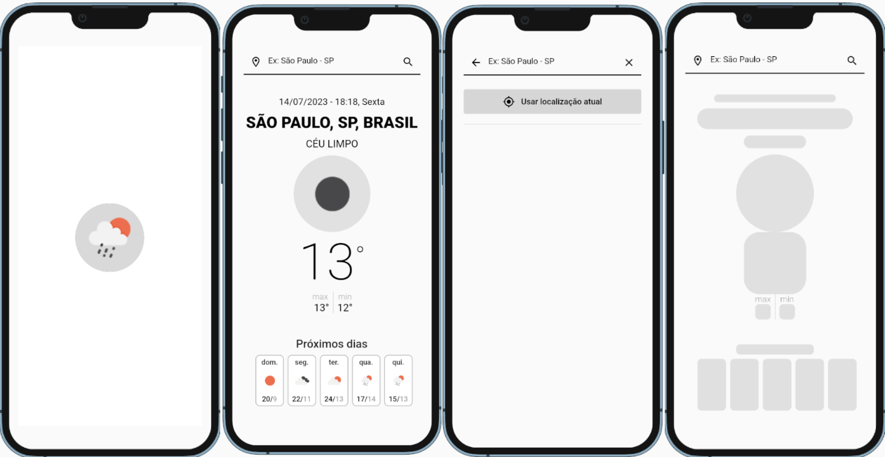

# Lopes Weather

## About this Project

The idea of the App is:

Have information about the weather and forecast of the user's current location and searched places.

## Why?

This project was developed just to compose the portfolio and I'm glad for any feedbacks that help me to be a better developer.

Email-me: [giovanelopes@id.uff.br](mailto:giovanelopes@id.uff.br)

LinkedIn: [Giovane Lopes - Linkedin](https://www.linkedin.com/in/giovane-lopes-da-silva-1228b3167/)

## Technologies Used
- Flutter
- Dart
- Cubit
- Modular
- Clean Architecture

## Installation and Usage
To install and use the project, follow these steps:

- Make sure you have the Flutter SDK installed on your development environment.

- Clone this repository to your local environment.

`git clone https://github.com/GiovaneLopes/lopes_weather.git`

- Navigate to the project directory.

`cd lopes_weather`

- Run the command to fetch the necessary dependencies.

`flutter pub get`

- Start the application on an emulator or connected device.

`flutter run`

- Make sure the emulator or connected device has internet acess.